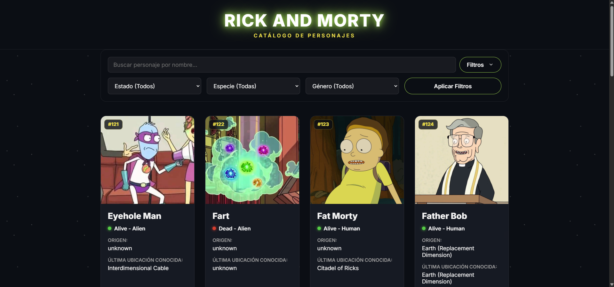
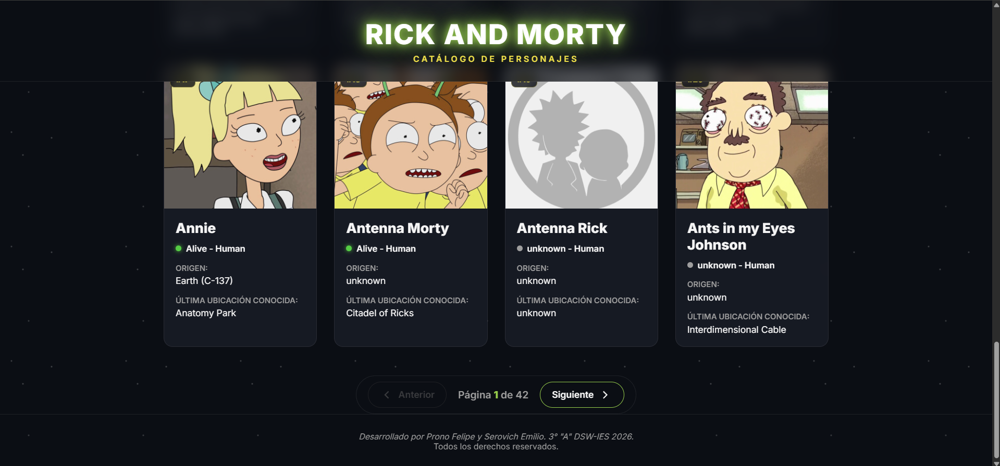
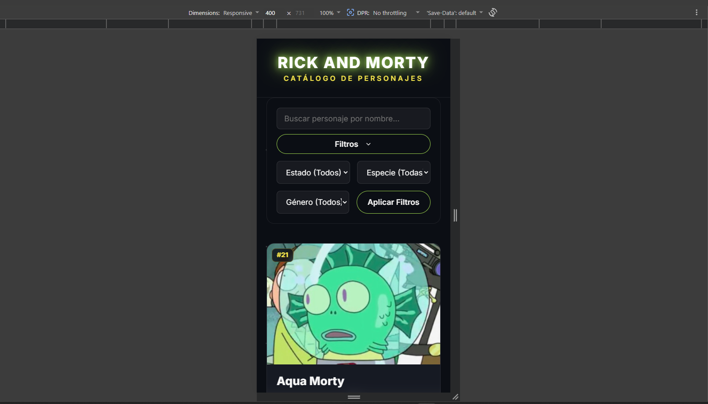

# Catálogo de personajes de Rick and Morty - Trabajo Práctico N°1 Programación 2.


## Integrantes del equipo:
* **Prono Felipe - DNI 43.165.905**
* **Serovich Emilio - DNI 43.770.166**

## Descripción del proyecto:
Esta aplicación web ofrece un catálogo completo de los personajes de la serie animada Rick and Morty, con funcionalidades de explorador interactivo para navegar por continuas páginas que contienen todos los personajes de la tira. La aplicación se conecta a la API pública oficial de Rick and Morty [(https://rickandmortyapi.com/)] para obtener datos en tiempo real de los personajes, incluyendo su imagen, estado de vida, especie, origen y última ubicación conocida.

El proyecto cuenta con un diseño responsivo, utilizando técnicas de CSS moderno, y está dividido lógicamente aplicando buenas prácticas de JavaScript (Módulos ES6). Se implementó un sistema de paginación para poder navegar a lo largo de los diferentes personajes que provee la API.

## Tecnologías utilizadas:
* **HTML5** (Estructura semántica)
* **CSS3** (Variables, Flexbox, CSS Grid)
* **JavaScript (ES6)** (Fetch API, Promesas, Async/Await, Módulos)
* **Git y GitHub** (Control de versiones colaborativo)

## Capturas del sistema:

1. **Vista General:** Pantalla principal mostrando el catálogo de personajes, junto a la barra de búsqueda y los filtros de búsqueda avanzados. Se enumeró a cada personaje según su ID correspondiente en la carga para poder buscarlos de esa manera también.


2. **Footer:** Pie de página con información básica y botones para controlar la paginación.


3. **Vista Mobile:** Diseño responsivo adaptado a dispositivos móviles.


## Cómo correr el proyecto localmente:

1. Clona este repositorio en tu máquina local:
   ```bash
   git clone https://github.com/emisero8/TP1_Prog1_Rick-MortyAPP_Prono-Serovich.git
   ```
2. Navega a la carpeta del proyecto:
   ```bash
   cd TP1_Prog1_Rick-MortyAPP_Prono-Serovich
   ```
3. Para visualizar correctamente los módulos de JavaScript, se debe abrir el archivo `index.html` utilizando un servidor local. 
   - Si se usa Visual Studio Code, recomendamos instalar la extensión **Live Server**.
   - Se debe seleccionar el archivo `index.html` y abrirlo preferentemente con Live Server.

## Link al deploy:

Link al proyecto en [GitHub Pages](https://emisero8.github.io/TP1_Prog1_Rick-MortyAPP_Prono-Serovich/) (click al texto en azul).

## API utilizada - créditos:

Los datos y las imágenes de los personajes utilizados en este catálogo son consumidos desde [The Rick and Morty API](https://rickandmortyapi.com/). Agradecemos a sus creadores (Axel Fuhrmann y contribuyentes) por mantener la API pública y de código abierto, que resulta de gran utilidad para el desarrollo y práctica de aplicaciones web.
